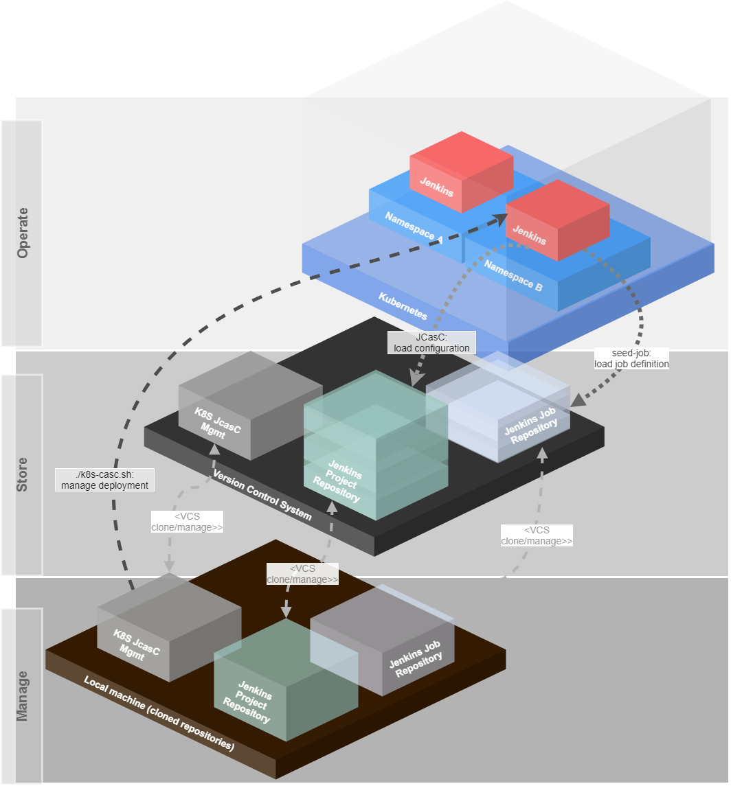

# Kubernetes Jenkins as Code management #

!!! UNDER CONSTRUCTION !!!

This project offers a template for managing Jenkins instances on Kubernetes with a JobDSL and Jenkins Configuration as Code (JcasC).

To simplify the installation and the project settings, it has a small helper tool `k8s-jcasc.sh`, which can be used in wizard mode or via arguments to
* create new projects for Jenkins administration
* manage secrets
    * encrypt/decrypt secrets for secure commit to a VCS (version control system)
    * apply secrets to kubernetes
    * store secrets globally for easy administration
    * store secrets per project for more security
* manage the Jenkins instances for a namespace with the project configuration
    * install
    * uninstall
    * upgrade

*The password for the preconfigured secrets file is `admin`. There is no valid data inside this file! Please change it for your own project!*


## Basic concept ##



* A namespace contains one Jenkins instance.
* The namespace is more or less equal to a k8s-mgmt project
    * Projects are stored in a separate repository in a VCS
    * The project contains
        * the Jenkins Helm Chart values.yaml overwrites
        * one JCasC file
* The Jenkins for each namespace will be deployed via k8s-mgmt from the cloned Git repository
* Jenkins loads its main configuration from the project repository (and only from this, which means you can play around and reload configuration directly from the remote URL)
* This main configuration also contains a very simple `seed-job`, which does a scm checkout of a Groovy script to manage jobs and a repository, which contains the job definition

### Advantages ##
By having all things stored in VCS repositories, which are normally backed up, it is possible to recreate every instance in no-time.
It is impossible to misconfigure a Jenkins instance, because the configuration can be reloaded from this remote repository and all configurations are completely versioned.

Also every develops maybe can have admin access to play around with the Jenkins, because they can not destroy the system permanently with the beloved "I have nothing done..." statement. 

If the K8S cluster or server crashes, it is possible to redeploy everything as it was in minutes, because also the job definition is stored in a VCS repository.


## Configuration ##

The system has a basic configuration file to pre-configure some global settings.
This file is located under [config/k8s_jcasc_mgmt.cnf](config/k8s_jcasc_mgmt.cnf).

It is recommended to change the `PROJECTS_BASE_DIRECTORY` to a directory outside of this project.
The `createproject` command will create new projects as subfolders of this directory.
All files and directories under the `PROJECTS_BASE_DIRECTORY' should be passed to a git repository which is backed up.

Then your existing Jenkins projects can be fully recovered from this repository.

## How to use ##

The simplest way is to call the script without arguments. Everything else will be asked by the script.

```bash
./k8s-jcasc.sh
```

For less selection and more control you can also give some arguments and the command to the script:

```bash
./k8s-jcasc.sh <arguments> <command>
```

The order of the arguments and commands are irrelevant.

### k8s-jcasc.sh arguments ###

It is possible to use multiple arguments.
The following arguments are supported:

| Argument | Description | Example |
| --- | --- | --- |
| `-p=` or `--projectdir=` | Defines the project directory (or project name) of the Jenkins configuration. This directory is a subdirectory of the configured `PROJECTS_BASE_DIRECTORY` | `-p=myproject` or `--projectdir=myproject` |
| `-n=` or `--namespace=` | Defines the target namespace in Kubernetes. It is not used for encrypting or decrypting secrets. | `-n=jenkins-namespace` or `--namespace=jenkins-namespace` |
| `-d=` or `--deploymentname=` | Defines the deployment name, which is relevant only for `install` and `uninstall`. This can also be configured globally for all projects as `JENKINS_MASTER_DEPLOYMENT_NAME` in the config file. | `-d=jenkins-master` or `--deploymentname=jenkins-master` |

### k8s-jcasc.sh commands ###

Only one command can be used. Multiple commands are *NOT* supported.
The following commands are supported:

| Command | Description |
| --- | --- |
| `install` | Install Jenkins to a Kubernetes namespace (helm install). |
| `uninstall` | Uninstall the Jenkins instance of a Kubernetes namespace (helm uninstall). |
| `upgrade` | Upgrade the Jenkins instance of a Kubernetes namespace (helm upgrade). |
| `encryptsecrets` | Encrypt the secrets (global secrets or project secrets, depending on configuration). |
| `decryptsecrets` | Decrypt the secrets (global secrets or project secrets, depending on configuration). |
| `applysecrets` | Apply the secrets to the Kubernetes namespace (global secrets or project secrets, depending on configuration). |
| `createproject` | Create a new Jenkins project for the configuration and deployment values from the templates. It uses a wizard to ask for relevant data. |

## IP Management ##

For greater installations and also after a recovery case, it is helpful to know which Jenkins instance is running behind which loadbalancer IP on which namespace.

To provide a simple solution, the system stores these information (namespace and IP) into a configuration file, which can also be backed up.
For every deployment of Jenkins, the system looks into this file and configures the loadbalancer with the IP. This also allows static DNS records.

If you create a new project via the wizard, the system also checks, if a IP address already exists to avoid IP conflicts.

# Helpful links #

- Kubernetes DNS-Based Service Discovery: https://github.com/kubernetes/dns/blob/master/docs/specification.md
- JCasC Examples: https://github.com/jenkinsci/configuration-as-code-plugin/tree/master/demos